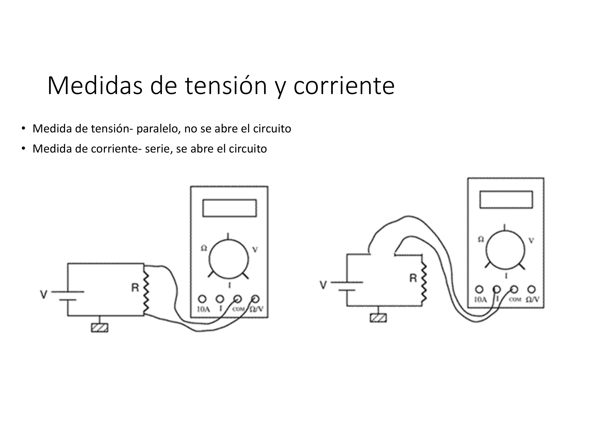
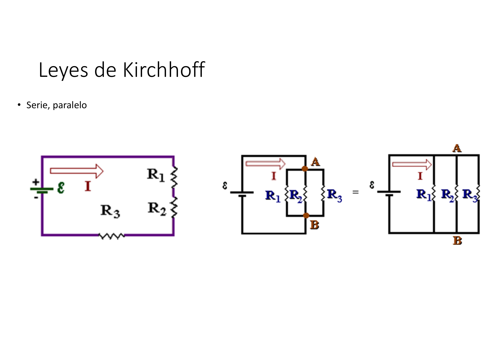
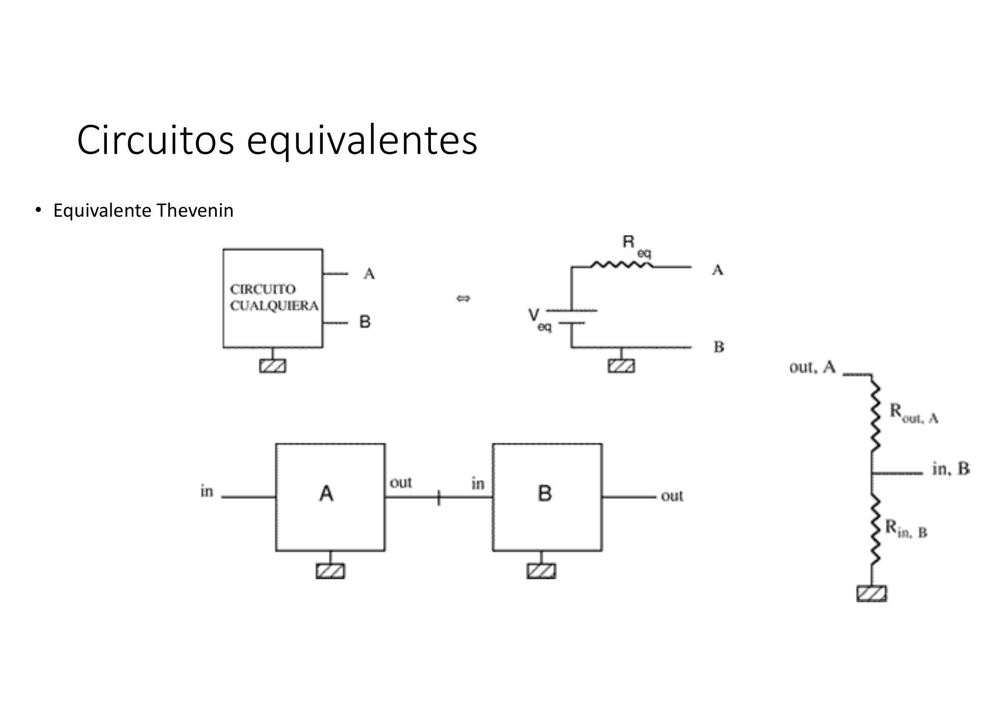
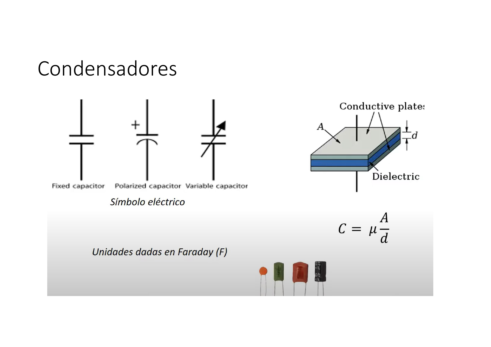
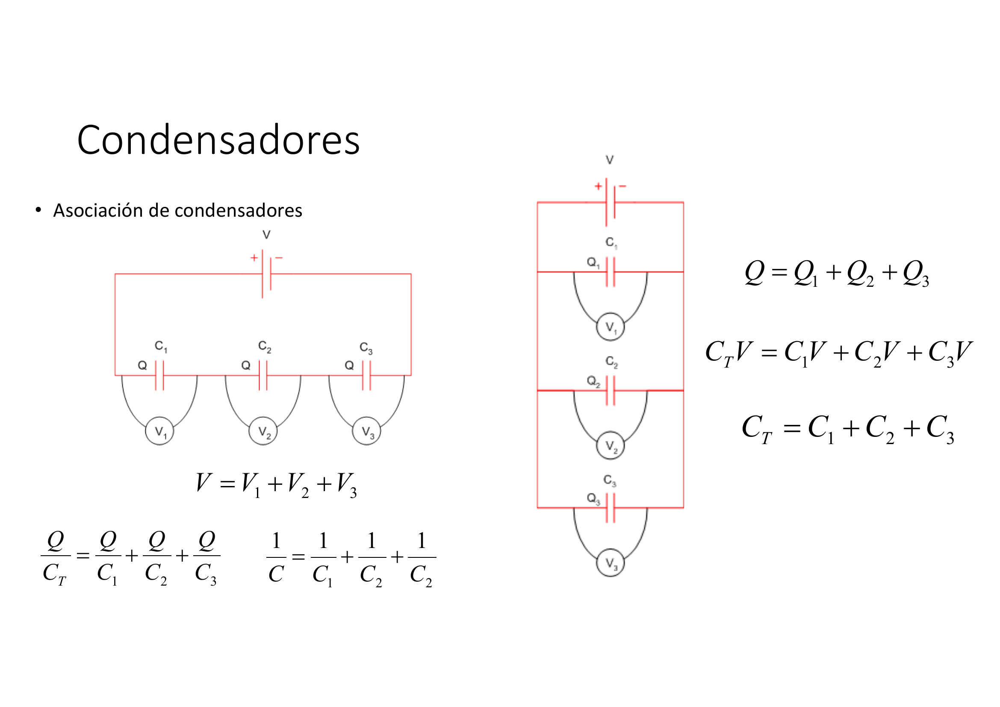
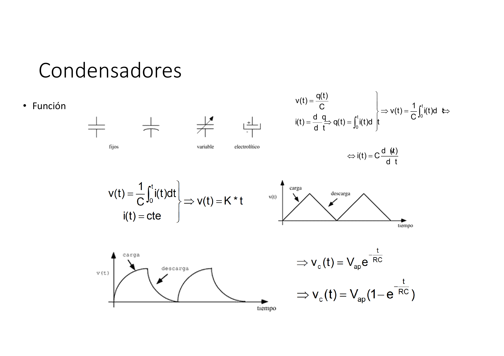
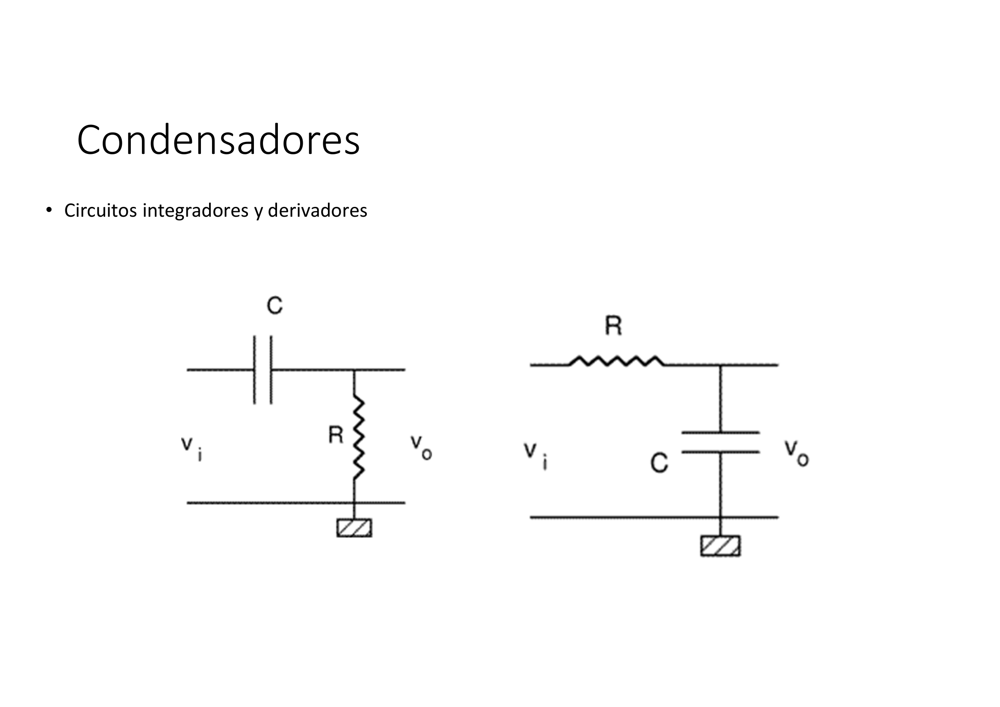

# Lecture Notes: BadSlides_LackingExplanations

***

## Slide 1: Medidas de tensión y corriente

---
**🤖 AI Synthesized Explanation:**
*Esta diapositiva introduce os métodos fundamentais para medir tensión e corrente nun circuíto eléctrico. Para medir a tensión, un voltímetro debe conectarse en paralelo co compoñente ou sección do circuíto onde se desexa coñecer a diferenza de potencial. Esta conexión en paralelo asegura que o circuíto non se interrompa e que o voltímetro, que posúe unha resistencia interna moi alta, non altere significativamente o fluxo de corrente principal.

Pola contra, para medir a corrente, un amperímetro debe conectarse en serie coa rama do circuíto a través da cal flúe a corrente. Isto implica abrir o circuíto para inserir o amperímetro. O amperímetro ten unha resistencia interna moi baixa para minimizar a súa influencia na corrente total do circuíto. As imaxes ilustran claramente estas dúas configuracións de conexión para un multímetro, mostrando como se conecta en paralelo para medir tensión e en serie para medir corrente.*

***

## Slide 2: Leyes de Kirchhoff

---
**🤖 AI Synthesized Explanation:**
*Esta diapositiva aborda as Leis de Kirchhoff, principios fundamentais para a análise de circuítos eléctricos, centrándose na asociación de resistencias en serie e en paralelo. Cando as resistencias están conectadas en serie, a corrente que flúe a través de cada unha delas é a mesma, e a tensión total a través da combinación é a suma das caídas de tensión individuais en cada resistencia. A resistencia equivalente dunha conexión en serie é simplemente a suma das resistencias individuais ($R_{eq} = R_1 + R_2 + R_3$).

No caso das resistencias conectadas en paralelo, a tensión a través de cada resistencia é a mesma, mentres que a corrente total que entra na combinación divídese entre as ramas. A corrente total é a suma das correntes que flúen por cada resistencia. A resistencia equivalente dunha conexión en paralelo calcúlase mediante a inversa da suma das inversas das resistencias individuais $(\frac{1}{R_{eq}} = \frac{1}{R_1} + \frac{1}{R_2} + \frac{1}{R_3})$. As imaxes mostran esquemas destas configuracións e as súas representacións equivalentes.*

***

## Slide 3: Circuitos equivalentes

---
**🤖 AI Synthesized Explanation:**
*A diapositiva introduce o concepto de circuítos equivalentes, destacando o Teorema de Thevenin. Este teorema é unha ferramenta poderosa na análise de circuítos que permite simplificar calquera circuíto lineal complexo, con fontes de tensión e corrente e resistencias, nun circuíto equivalente moito máis sinxelo. Este circuíto equivalente de Thevenin consta unicamente dunha fonte de tensión ($V_{eq}$) en serie cunha resistencia ($R_{eq}$), vista desde dous terminais específicos (A e B).

A tensión equivalente de Thevenin ($V_{eq}$) é a tensión en circuíto aberto entre os terminais A e B. A resistencia equivalente de Thevenin ($R_{eq}$) é a resistencia total vista desde os terminais A e B cando todas as fontes independentes do circuíto orixinal son "apagadas" (as fontes de tensión substitúense por curtocircuítos e as fontes de corrente por circuítos abertos). As imaxes ilustran esta simplificación, mostrando como un "circuíto calquera" pode ser representado polo seu equivalente de Thevenin, e tamén como diferentes bloques de circuítos poden combinarse ou analizarse en termos de resistencias de entrada e saída.*

***

## Slide 4: Condensadores

---
**🤖 AI Synthesized Explanation:**
*Esta diapositiva introduce os condensadores, compoñentes pasivos que almacenan enerxía nun campo eléctrico. Preséntanse os símbolos eléctricos comúns para diferentes tipos de condensadores: fixos (capacitancia constante), polarizados (con polaridade definida, usados principalmente en circuítos de corrente continua) e variables (cuxa capacitancia pode ser axustada). Cada símbolo reflicte a construción e o uso específico do condensador.

Ademais, a diapositiva mostra a estrutura física dun condensador de placas paralelas, que consiste en dúas placas condutoras separadas por un material dieléctrico. A capacitancia ($C$) dun condensador de placas paralelas está determinada pola área ($A$) das placas, a distancia ($d$) entre elas e a permitividade do material dieléctrico ($\mu$, que debería ser $\epsilon$). A fórmula $C = \mu \frac{A}{d}$ indica que a capacitancia aumenta coa área das placas e coa permitividade do dieléctrico, e diminúe coa distancia entre as placas. A unidade de medida da capacitancia é o Faraday (F), nomeada en honra a Michael Faraday.*

***

## Slide 5: Condensadores

---
**🤖 AI Synthesized Explanation:**
*Esta diapositiva explica como se comportan os condensadores cando se asocian en serie e en paralelo, e como se calcula a capacitancia equivalente para cada configuración. Cando os condensadores están conectados en serie, a carga ($Q$) almacenada en cada un é a mesma, pero a tensión total ($V$) a través da combinación é a suma das tensións individuais en cada condensador ($V = V_1 + V_2 + V_3$). A capacitancia equivalente ($C_T$) para condensadores en serie calcúlase de forma similar á resistencia en paralelo: a inversa da capacitancia total é a suma das inversas das capacitancias individuais ($\frac{1}{C_T} = \frac{1}{C_1} + \frac{1}{C_2} + \frac{1}{C_3}$). Isto significa que a capacitancia equivalente en serie é sempre menor que a menor das capacitancias individuais.

Pola contra, cando os condensadores están conectados en paralelo, a tensión ($V$) a través de cada un é a mesma, mentres que a carga total ($Q$) almacenada é a suma das cargas individuais ($Q = Q_1 + Q_2 + Q_3$). A capacitancia equivalente ($C_T$) para condensadores en paralelo é simplemente a suma das capacitancias individuais ($C_T = C_1 + C_2 + C_3$). Isto resulta nunha capacitancia total maior que calquera das capacitancias individuais. As imaxes ilustran estas conexións e as súas respectivas fórmulas.*

***

## Slide 6: Condensadores

---
**🤖 AI Synthesized Explanation:**
*Esta diapositiva explora a función e o comportamento dinámico dos condensadores, incluíndo as relacións fundamentais entre tensión, corrente e carga. A tensión a través dun condensador ($v(t)$) é directamente proporcional á carga ($q(t)$) almacenada e inversamente proporcional á súa capacitancia ($C$), expresado como $v(t) = \frac{q(t)}{C}$. A corrente ($i(t)$) que flúe a través dun condensador é a taxa de cambio da carga con respecto ao tempo ($i(t) = \frac{d}{dt} q(t)$). Integrando esta relación, obtense que a tensión é a integral da corrente dividida pola capacitancia ($v(t) = \frac{1}{C} \int_{0}^{t} i(t)dt$), e derivando a primeira relación, a corrente é a capacitancia multiplicada pola taxa de cambio da tensión ($i(t) = C \frac{d}{dt} v(t)$).

Cando un condensador se carga ou descarga cunha corrente constante, a tensión a través del cambia linealmente co tempo. Non obstante, nun circuíto RC (resistencia-condensador), o proceso de carga e descarga segue unha curva exponencial. Durante a descarga, a tensión no condensador diminúe exponencialmente segundo a fórmula $v_c(t) = V_{ap} e^{-\frac{t}{RC}}$, onde $V_{ap}$ é a tensión inicial e $RC$ é a constante de tempo do circuíto. Durante a carga, a tensión aumenta exponencialmente cara a unha tensión final, descrita por $v_c(t) = V_{ap} (1 - e^{-\frac{t}{RC}})$. Estes comportamentos son cruciais para entender como os condensadores se usan en aplicacións de temporización e filtrado.*

***

## Slide 7: Condensadores

---
**🤖 AI Synthesized Explanation:**
*Esta diapositiva final sobre condensadores introduce dous tipos de circuítos RC fundamentais: os circuítos integradores e os circuítos derivadores. Estes circuítos aproveitan as propiedades de almacenamento de enerxía dos condensadores e a relación entre tensión e corrente para realizar operacións matemáticas básicas sobre sinais eléctricos.

Un circuíto integrador, tipicamente un filtro paso-baixo, produce unha tensión de saída ($v_o$) que é aproximadamente proporcional á integral da tensión de entrada ($v_i$) ao longo do tempo, especialmente cando a constante de tempo RC é moito maior que o período do sinal de entrada. A configuración máis común para un integrador pasivo ten a resistencia en serie coa entrada e o condensador en paralelo coa saída. Pola contra, un circuíto derivador, que actúa como un filtro paso-alto, produce unha tensión de saída que é aproximadamente proporcional á derivada da tensión de entrada con respecto ao tempo. A súa configuración pasiva típica ten o condensador en serie coa entrada e a resistencia en paralelo coa saída. Estes circuítos son esenciais en procesamento de sinais, xeración de formas de onda e moitas outras aplicacións electrónicas.*

***

