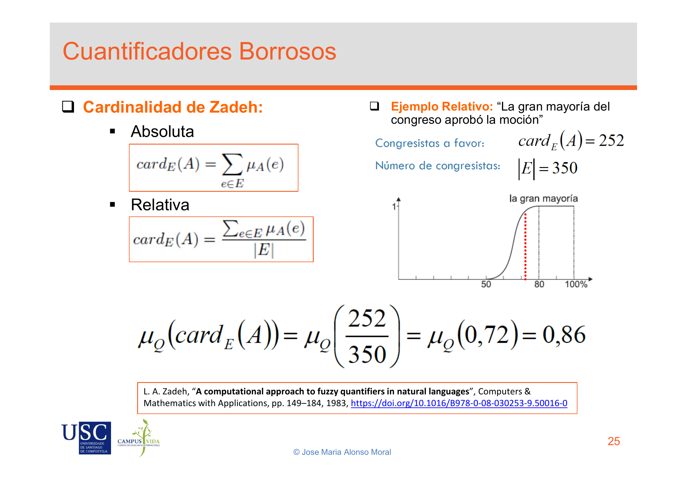
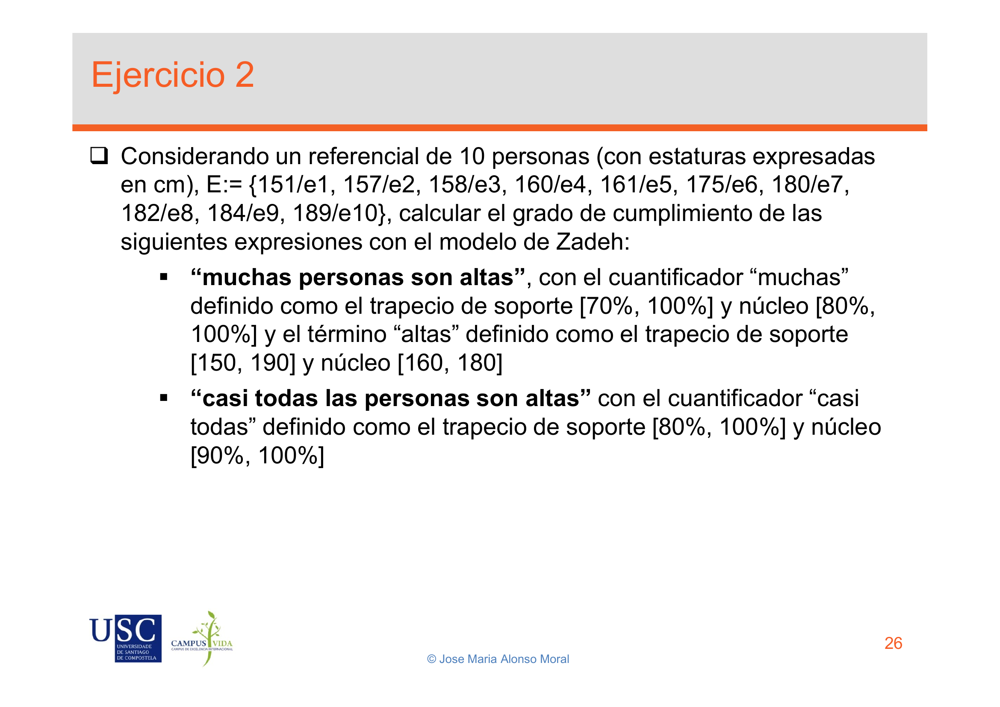
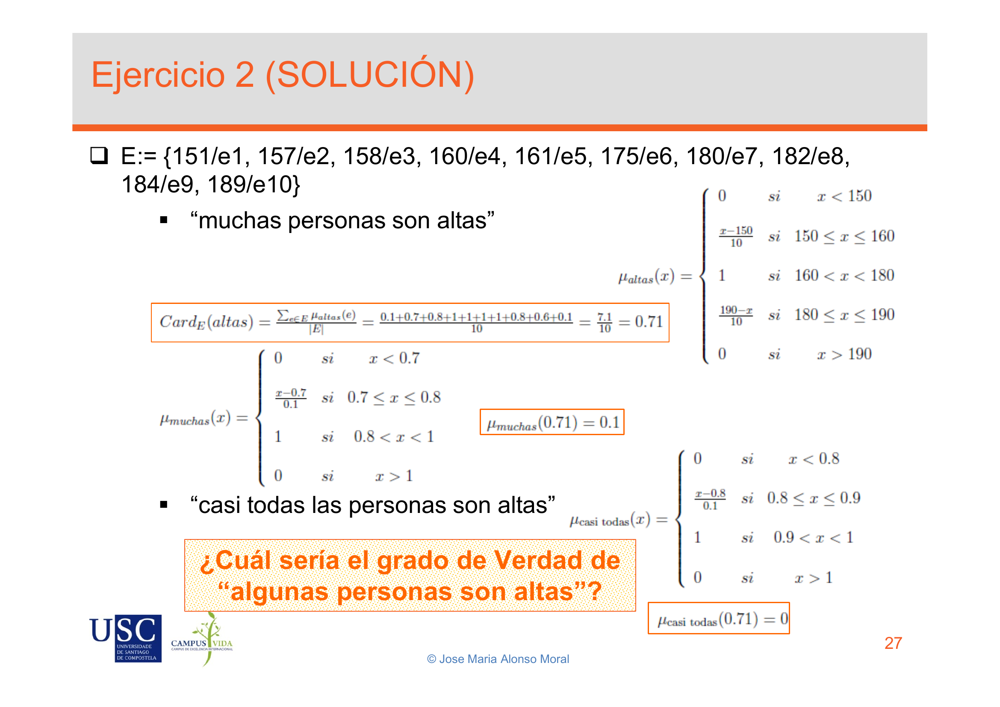

# Lecture Notes: BadSlides_LatexInImages

***

## Slide 1: Cuantificadores Borrosos

### Slide Contents
Cuantificadores Borrosos
Cardinalidad de Zadeh:
Absoluta
$$card_E(A) = \sum_{e \in E} \mu_A(e)$$
Relativa
$$card_E(A) = \frac{\sum_{e \in E} \mu_A(e)}{|E|}$$
Ejemplo Relativo: "La gran mayoría del congreso aprobó la moción"
Congresistas a favor: $card_E(A) = 252$
Número de congresistas: $|E| = 350$
(Image of a fuzzy membership function for "la gran mayoría" with x-axis 50, 80, 100% and y-axis 0 to 1. The function rises from 0 at 50 to 1 at 80 and stays 1 until 100.)
$$\mu_Q(card_E(A)) = \mu_Q\left(\frac{252}{350}\right) = \mu_Q(0.72) = 0.86$$
L. A. Zadeh, "A computational approach to fuzzy quantifiers in natural languages", Computers & Mathematics with Applications, pp. 149–184, 1983, https://doi.org/10.1016/B978-0-08-030253-9.50016-0
© Jose Maria Alonso Moral 25

---
**🤖 AI Synthesized Explanation:**
*This slide introduces fuzzy quantifiers, specifically focusing on Zadeh's definition of fuzzy cardinality. It distinguishes between absolute and relative fuzzy cardinality. Absolute fuzzy cardinality is defined as the sum of the membership degrees of elements in a fuzzy set A over a universe E. Relative fuzzy cardinality normalizes this sum by dividing it by the total number of elements in the universe E, effectively representing the proportion of elements that belong to the fuzzy set.
The slide then provides a practical example using a relative fuzzy quantifier: "the vast majority of the congress approved the motion." It quantifies this by stating that 252 out of 350 congress members approved, which is a proportion of 0.72. A membership function for "the vast majority" is shown, indicating that a proportion of 0.72 has a membership degree of 0.86 in the fuzzy set "the vast majority." This demonstrates how linguistic quantifiers can be represented and evaluated using fuzzy set theory.*

***

## Slide 2: Ejercicio 2

### Slide Contents
Ejercicio 2
Considerando un referencial de 10 personas (con estaturas expresadas en cm), E:= {151/e1, 157/e2, 158/e3, 160/e4, 161/e5, 175/e6, 180/e7, 182/e8, 184/e9, 189/e10}, calcular el grado de cumplimiento de las siguientes expresiones con el modelo de Zadeh:
"muchas personas son altas", con el cuantificador "muchas" definido como el trapecio de soporte [70%, 100%] y núcleo [80%, 100%] y el término "altas" definido como el trapecio de soporte [150, 190] y núcleo [160, 180]
"casi todas las personas son altas" con el cuantificador "casi todas" definido como el trapecio de soporte [80%, 100%] y núcleo [90%, 100%]
© Jose Maria Alonso Moral 26

---
**🤖 AI Synthesized Explanation:**
*This slide presents an exercise designed to apply Zadeh's model for fuzzy quantifiers. The problem involves a universe of 10 individuals, each with a specific height in centimeters. The task is to calculate the degree of truth for two linguistic expressions: "many people are tall" and "almost all people are tall."
For each expression, the slide provides the definitions of the fuzzy sets involved. For "many people are tall," the quantifier "many" is defined by a trapezoidal membership function with a support of [70%, 100%] and a core of [80%, 100%]. The fuzzy predicate "tall" is also defined by a trapezoidal membership function with a support of [150 cm, 190 cm] and a core of [160 cm, 180 cm]. Similarly, for "almost all people are tall," the quantifier "almost all" is defined by a trapezoidal membership function with a support of [80%, 100%] and a core of [90%, 100%]. The exercise requires combining these fuzzy definitions with the given heights of the 10 individuals to determine the overall truth value of each statement.*

***

## Slide 3: Ejercicio 2 (SOLUCIÓN)

### Slide Contents
Ejercicio 2 (SOLUCIÓN)
E:= {151/e1, 157/e2, 158/e3, 160/e4, 161/e5, 175/e6, 180/e7, 182/e8, 184/e9, 189/e10}
"muchas personas son altas"
$$\mu_{altas}(x) = \begin{cases} 0 & \text{si } x < 150 \\ \frac{x-150}{10} & \text{si } 150 \le x < 160 \\ 1 & \text{si } 160 \le x < 180 \\ \frac{190-x}{10} & \text{si } 180 \le x < 190 \\ 0 & \text{si } x > 190 \end{cases}$$
$$Card_E(altas) = \frac{\sum_{e \in E} \mu_{altas}(e)}{|E|} = \frac{0.1+0.7+0.8+1+1+0.8+0.6+0.4+0.2+0}{10} = \frac{7.1}{10} = 0.71$$
$$\mu_{muchas}(x) = \begin{cases} 0 & \text{si } x < 0.7 \\ \frac{x-0.7}{0.1} & \text{si } 0.7 \le x < 0.8 \\ 1 & \text{si } 0.8 \le x < 1 \\ 0 & \text{si } x > 1 \end{cases}$$
$\mu_{muchas}(0.71) = 0.1$
"casi todas las personas son altas"
$$\mu_{casi\ todas}(x) = \begin{cases} 0 & \text{si } x < 0.8 \\ \frac{x-0.8}{0.1} & \text{si } 0.8 \le x < 0.9 \\ 1 & \text{si } 0.9 \le x < 1 \\ 0 & \text{si } x > 1 \end{cases}$$
¿Cuál sería el grado de Verdad de "algunas personas son altas"?
$\mu_{casi\ todas}(0.71) = 0$
© Jose Maria Alonso Moral 27

---
**🤖 AI Synthesized Explanation:**
*This slide provides the solution to Exercise 2, demonstrating the step-by-step calculation for evaluating fuzzy quantified statements. First, it reiterates the universe of 10 individuals with their heights. For the statement "many people are tall," the membership function for "tall" ($\mu_{altas}(x)$) is explicitly defined as a trapezoidal function. This function is then used to calculate the membership degree of each individual's height in the fuzzy set "tall."
Next, the relative fuzzy cardinality of "tall" individuals is computed by summing these membership degrees and dividing by the total number of people (10), resulting in 0.71. Finally, this relative cardinality (0.71) is used as input to the membership function for the fuzzy quantifier "many" ($\mu_{muchas}(x)$), which is also explicitly defined. The result, $\mu_{muchas}(0.71) = 0.1$, represents the degree of truth for the statement "many people are tall." The slide also partially shows the membership function for "almost all" and calculates its value for 0.71, which is 0. A follow-up question is posed, asking for the degree of truth for "some people are tall," implying a similar calculation would be needed if the fuzzy quantifier "some" were defined.*

***

